# Microsoft Entra Identity Security Lab

**Part 1 of 3 — Microsoft 365 Enterprise Administration & Security Series**

## The Problem This Lab Solves

Enterprise Microsoft 365 environments require identity controls that go beyond passwords and permanent administrative access. Administrators must enforce multifactor authentication, introduce phishing-resistant sign-in methods, evaluate risky authentication events, and provide privileged access only when required.

In this project, I built and validated a Microsoft Entra identity-security workflow in a dedicated Microsoft 365 test environment. I focused on practical enterprise controls including group-scoped Conditional Access, report-only policy validation, Microsoft Authenticator MFA, FIDO2 passkeys, sign-in risk evaluation, Privileged Identity Management, time-bound role activation, and audit-log verification.

---

## Project Objectives

I designed this lab to demonstrate my ability to:

- Establish a licensed Microsoft 365 identity-security test environment
- Use a security group to control the scope of an identity-policy rollout
- Create a Conditional Access policy that requires multifactor authentication
- Validate Conditional Access behavior in report-only mode before enforcement
- Enable the validated policy and functionally test the user sign-in experience
- Configure FIDO2 security key and passkey authentication
- Register and validate a passkey for a test identity
- Configure a sign-in risk policy for medium- and high-risk sign-ins
- Use the Conditional Access What If tool to simulate policy evaluation
- Configure Microsoft Entra PIM for the Conditional Access Administrator role
- Replace standing privilege with eligible, time-bound role access
- Require MFA and business justification for privileged access
- Validate role activation, expiration, and removal through PIM audit records
- Apply Zero Trust and least-privilege security principles

---

## Technologies Used

- Microsoft Entra ID
- Microsoft Entra Admin Center
- Microsoft 365 E5
- Microsoft Entra Conditional Access
- Microsoft Authenticator
- FIDO2 security keys and passkeys
- Microsoft Entra ID Protection
- Conditional Access What If
- Microsoft Entra Privileged Identity Management
- Microsoft Entra audit logs
- Microsoft 365 cloud applications

---

## Lab Environment

I performed this project in a dedicated Microsoft 365 development/test tenant.

I used the following controlled resources:

| Resource | Purpose |
| --- | --- |
| Microsoft 365 E5 test users | Licensed identities used for policy configuration and functional validation |
| M365-Enterprise-Security-Users | Security group used to scope Conditional Access and authentication-method deployment |
| Conditional Access MFA policy | Requires multifactor authentication for the targeted lab users |
| Sign-in risk MFA policy | Evaluates medium- and high-risk sign-ins and requires MFA in report-only mode |
| FIDO2 authentication method | Provides phishing-resistant passkey authentication to the lab group |
| David Cohen | Eligible PIM test user for the Conditional Access Administrator role |
| Conditional Access Administrator | Privileged role governed through PIM activation controls |

I used test identities and controlled policy evaluations throughout the project rather than production user accounts or production access policies.

---

## Architecture and Logical Workflow

I designed the lab around two connected Microsoft Entra security workflows:

1. User authentication and Conditional Access evaluation
2. Privileged role eligibility, activation, expiration, and auditing

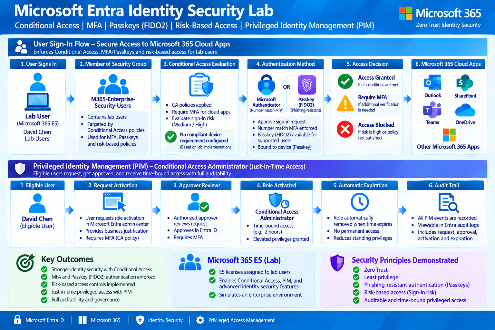

The primary user sign-in workflow was:

**User Sign-In → Security-Group Scope → Conditional Access Evaluation → Authenticator MFA or FIDO2 Passkey → Access Decision**

The privileged-access workflow was:

**Eligible User → Activation Request → MFA and Justification → Approval → Time-Bound Conditional Access Administrator Access → Expiration → Audit Trail**

David Cohen was used only as the eligible PIM test identity. His PIM eligibility is separate from the M365-Enterprise-Security-Users group shown in the user sign-in workflow.

The lab did not configure or test a compliant-device requirement.

---

# Implementation

## 1. Establish the Microsoft 365 Licensing Baseline

I assigned Microsoft 365 E5 licensing to the lab identities and verified that the identity-security capabilities required for the project were available.

I completed this step before configuring Conditional Access, authentication methods, identity risk, or PIM.

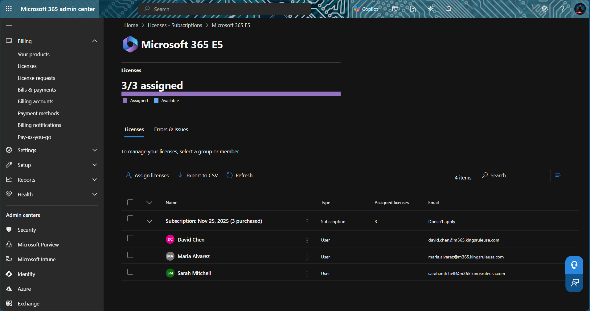

---

## 2. Create the Identity-Security Pilot Group

I used the **M365-Enterprise-Security-Users** security group to establish a controlled deployment scope.

Group-based targeting allowed me to:

- Limit the initial policy scope
- Avoid applying a new control to every tenant user
- Test the expected behavior with designated lab identities
- Reduce the risk of unintended access disruption

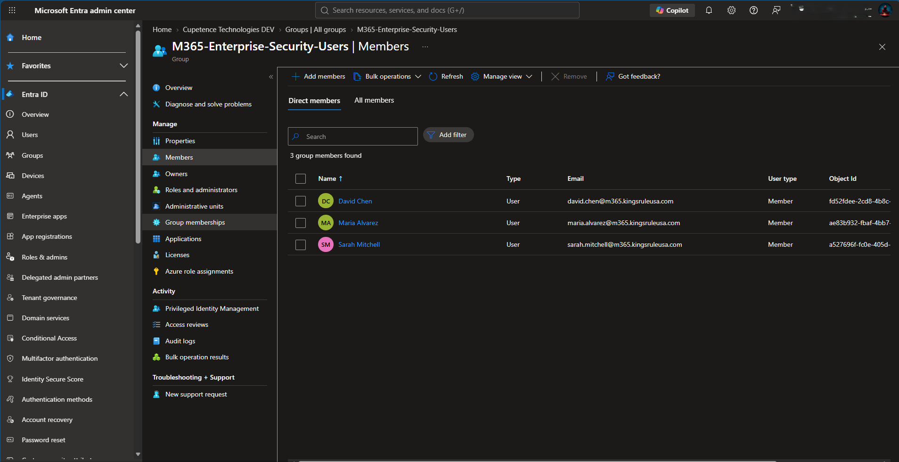

---

## 3. Create the MFA Conditional Access Policy

I created a Conditional Access policy that required multifactor authentication for the targeted lab group.

I initially placed the policy in **Report-only** mode so Microsoft Entra could evaluate it during sign-in without immediately enforcing the access control.

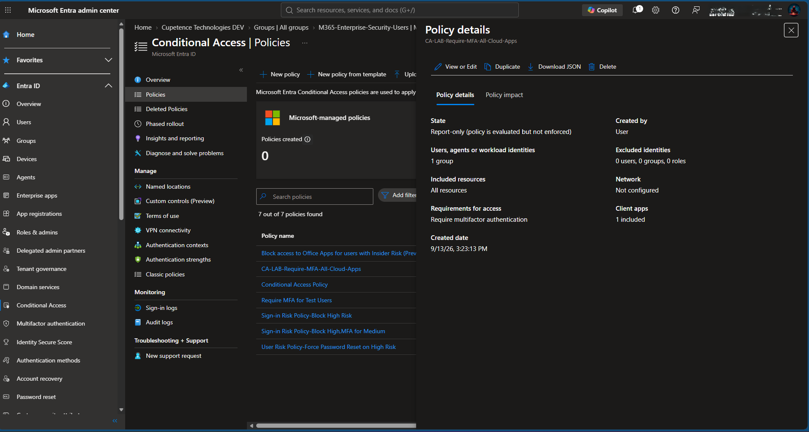

---

## 4. Validate the Report-Only Policy

Before enabling enforcement, I reviewed the report-only evaluation results to confirm that the intended policy was applied to the expected sign-in.

This validation reduced the risk of:

- Targeting the wrong identities
- Enforcing an incorrectly configured policy
- Interrupting legitimate access
- Creating an avoidable tenant lockout condition

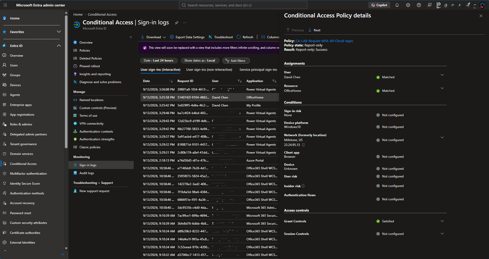

---

## 5. Enable the MFA Conditional Access Policy

After validating the policy behavior, I changed the MFA policy from report-only to enabled.

I followed a controlled deployment workflow:

**Configure → Report-Only → Review → Enable → Functional Test → Validate**

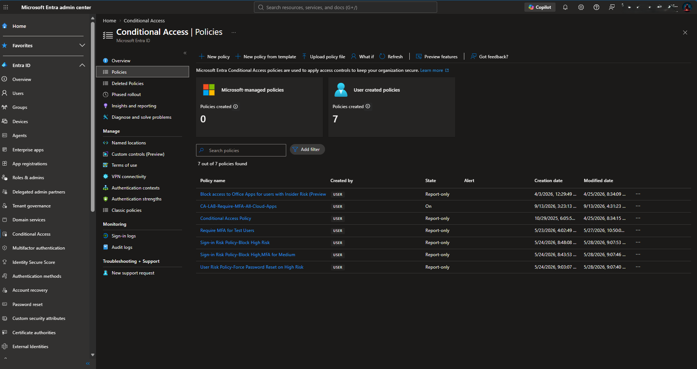

---

## 6. Validate the MFA Enforcement Prompt

I performed a controlled sign-in using a targeted test identity.

Microsoft Entra applied the enabled Conditional Access policy and presented the expected Microsoft Authenticator challenge.

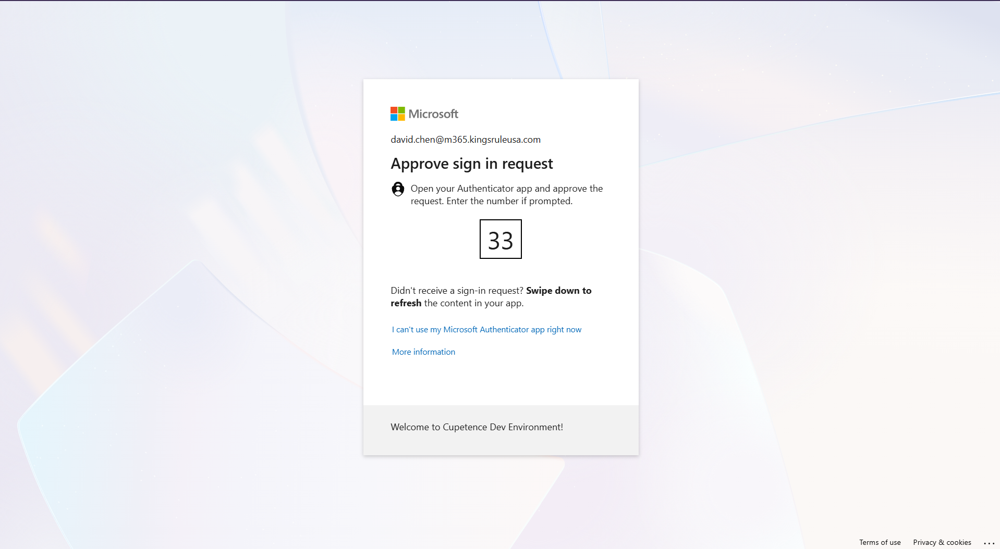

---

## 7. Confirm Successful MFA Enforcement

The test user successfully completed the Microsoft Authenticator challenge and gained access to the protected Microsoft 365 resource.

This functional test confirmed that:

- The test identity was within the intended policy scope
- Conditional Access evaluated the sign-in
- MFA was required
- The authentication challenge completed successfully
- Access was granted after the control was satisfied

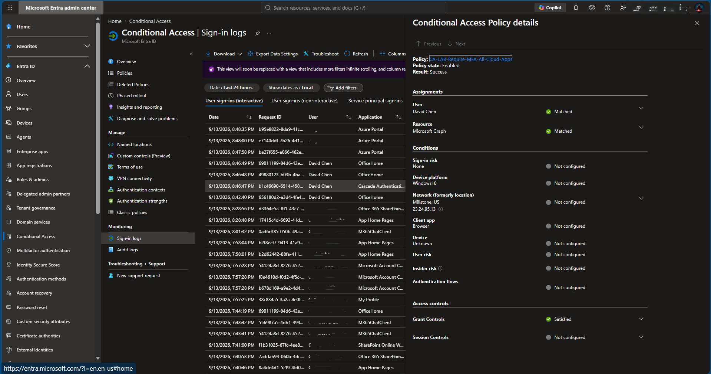

---

# Phishing-Resistant Authentication

## 8. Configure FIDO2 Passkeys for the Lab Group

I enabled the FIDO2 security key authentication method for the designated lab group.

Group-scoped configuration allowed me to introduce phishing-resistant authentication through a controlled pilot rather than making it available tenant-wide without validation.

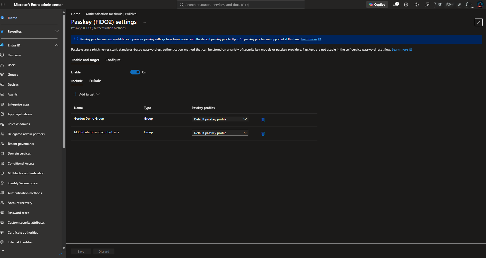

---

## 9. Register and Validate a FIDO2 Passkey

I registered a passkey for the test identity and confirmed that Microsoft Entra displayed the newly created authentication method.

This demonstrated practical implementation of passwordless, phishing-resistant authentication.

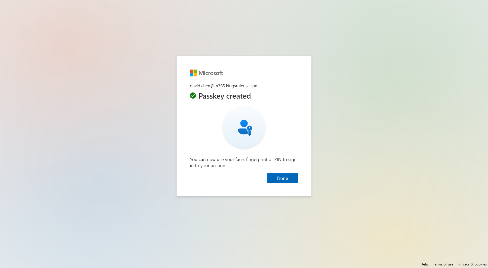

---

# Privileged Identity Management

## 10. Configure PIM Role Activation Controls

I configured activation requirements for the **Conditional Access Administrator** role.

The PIM controls included:

- Time-limited activation
- Azure multifactor authentication
- Business justification
- Approval-based activation
- Auditable privileged-access events

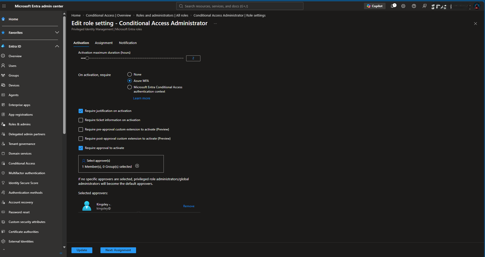

---

## 11. Configure PIM Assignment Controls

I reviewed and configured the assignment controls for the Conditional Access Administrator role.

The configuration demonstrated that:

- Permanent eligible assignments were not allowed
- Eligible assignments expired after three months
- Permanent active assignments were not allowed
- Active assignments expired after one month
- MFA was required for active assignment
- Justification was required for active assignment

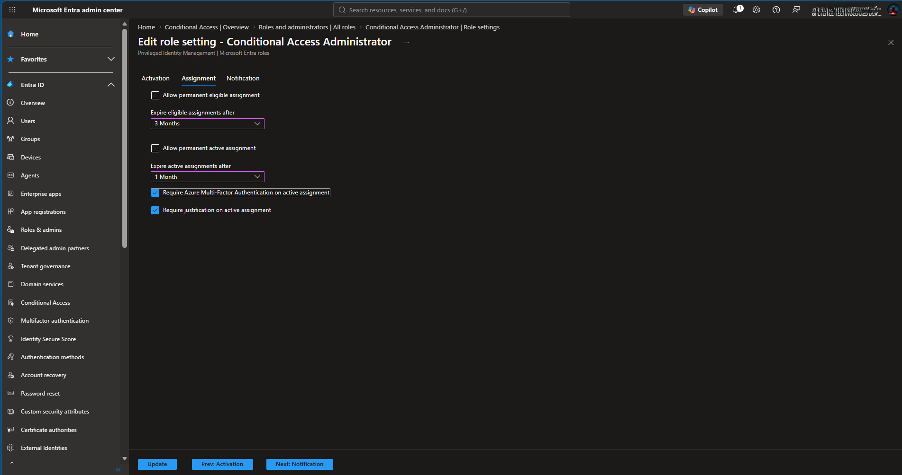

These controls reduce standing administrative privilege and establish defined limits for privileged-role assignments.

---

# Risk-Based Conditional Access

## 12. Configure the Sign-In Risk MFA Policy

I configured the **CA-LAB-SignIn-Risk-MFA** Conditional Access policy.

### Policy Configuration

~~~text
State:
Report-only

Target:
1 security group

Resources:
All resources

Sign-in risk:
Medium and High

Grant control:
Require multifactor authentication
~~~

The policy remained in report-only mode. This project demonstrates risk-policy configuration and evaluation rather than production enforcement of the risk-based policy.

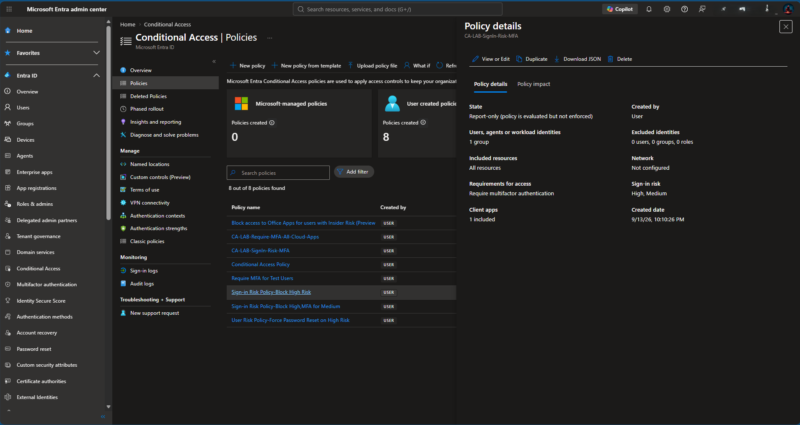

---

## 13. Validate Policy Behavior with What If

I used the Conditional Access **What If** tool to simulate a medium-risk sign-in.

The evaluation showed that two policies would apply:

- The enabled all-cloud-apps MFA policy
- The report-only sign-in risk MFA policy

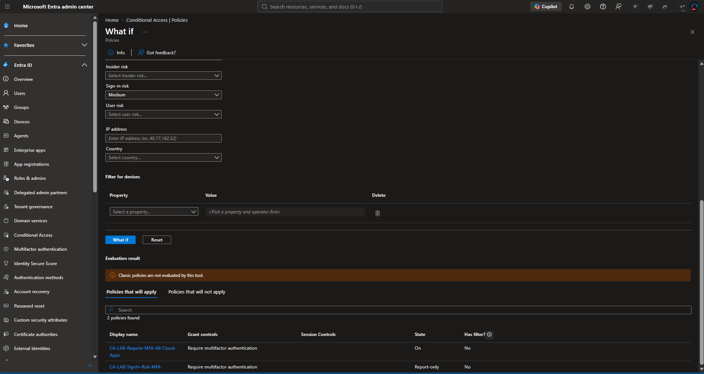

This allowed me to validate policy interaction without generating an actual risky sign-in or prematurely enforcing the risk-based policy.

---

# PIM Functional Validation and Auditing

## 14. Activate the Conditional Access Administrator Role

The eligible PIM test user completed the governed activation workflow for the Conditional Access Administrator role.

The role appeared under active assignments with:

- Activated status
- Direct membership during the activation window
- A defined expiration time
- The option to deactivate before expiration

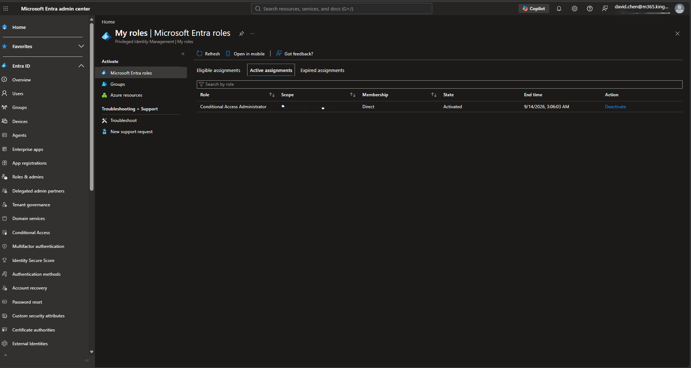

This confirmed that the user could obtain administrative access when required without retaining permanent standing privilege.

---

## 15. Validate the PIM Resource Audit Trail

I reviewed the Microsoft Entra PIM resource audit history after the privileged-access exercise.

The audit records captured the complete workflow:

**Eligible Assignment → Activation Requested → Approval Requested → Request Approved → Activation Completed → Activation Expired → User Removed from Role**

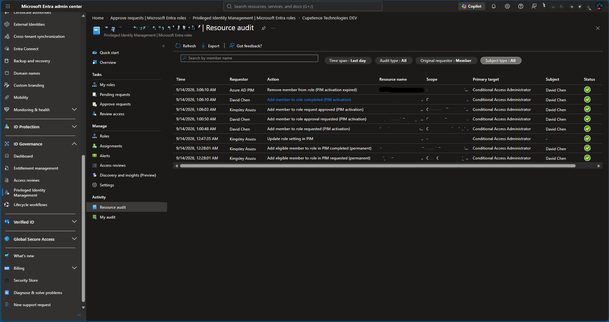

The audit trail demonstrated that the privileged-access lifecycle was traceable from eligibility through automatic removal.

---

# Validation Results

| Control / Test | Expected Result | Result |
| --- | --- | --- |
| Microsoft 365 E5 licensing | Required identity-security features available | PASS |
| Security-group targeting | Controls scoped to the intended pilot group | PASS |
| Conditional Access report-only evaluation | Policy impact visible without enforcement | PASS |
| MFA policy enablement | Validated policy changed to enabled | PASS |
| MFA challenge | Targeted user prompted for multifactor authentication | PASS |
| MFA completion | Authentication completed and access granted | PASS |
| FIDO2 group configuration | Passkeys available to the designated lab group | PASS |
| Passkey registration | Test identity successfully registered a passkey | PASS |
| PIM activation controls | MFA, justification, approval, and duration configured | PASS |
| PIM assignment controls | Permanent assignments restricted and expiration configured | PASS |
| Sign-in risk policy | Medium- and high-risk sign-ins evaluated for MFA | PASS |
| What If simulation | Expected MFA policies identified | PASS |
| PIM role activation | Eligible role activated with a defined end time | PASS |
| PIM expiration | Activated role expired and was removed | PASS |
| PIM resource audit | Complete privileged-access workflow recorded | PASS |

---

# Security and Operational Principles Demonstrated

## Zero Trust Access

I treated every sign-in as an access decision that must be evaluated using identity, policy scope, authentication strength, and sign-in context.

Access was granted only after the targeted user satisfied the required authentication control.

## Least Privilege

I configured the Conditional Access Administrator role as eligible rather than permanently active.

The test identity obtained administrative access only through the PIM activation workflow and lost the role when the activation period expired.

## Controlled Policy Deployment

I did not move directly from policy creation to enforcement.

The Conditional Access workflow was:

**Configure → Report-Only → Review → Enable → Test → Validate**

## Phishing-Resistant Authentication

I enabled and registered a FIDO2 passkey to demonstrate an authentication method that provides stronger phishing resistance than password-only access.

## Risk-Aware Access

I configured the sign-in risk policy for medium- and high-risk events and used What If analysis to validate the expected outcome while the policy remained in report-only mode.

## Privileged-Access Auditability

I verified the PIM audit records rather than treating a successful portal configuration as sufficient evidence.

The audit history confirmed eligibility, activation, approval, expiration, and removal.

---

# Troubleshooting Lessons

## Conditional Access Safety

Conditional Access policies can interrupt access when they are scoped or configured incorrectly.

I reduced this risk by targeting a controlled security group, using report-only mode, reviewing evaluation results, and maintaining a clear functional test plan before enforcement.

## Policy Evaluation versus Enforcement

A report-only policy can appear in sign-in evaluation results without actively blocking access or requiring the configured grant control.

I distinguished policy evaluation from enforcement when interpreting the sign-in risk and What If results.

## Authentication-Method Scope

Enabling FIDO2 authentication does not automatically make the method available to every user.

I confirmed that the authentication method was targeted to the correct lab group before registering the passkey.

## PIM Eligibility versus Active Access

An eligible assignment does not provide continuous administrative permissions.

The user had to activate the role through PIM before the Conditional Access Administrator permissions became available.

## PIM Activation versus Assignment Settings

PIM uses separate settings for activation requirements and assignment duration.

I reviewed both areas to confirm that privileged access required the intended activation safeguards and that permanent assignments were restricted.

## Audit Validation

Portal confirmation alone does not prove that the full privileged-access lifecycle worked correctly.

I used the resource audit history to verify the request, approval, activation, expiration, and automatic role removal.

---

# Skills Demonstrated

Through this project, I demonstrated hands-on experience with:

- Microsoft Entra ID administration
- Microsoft 365 identity security
- Microsoft Entra Conditional Access
- Group-scoped policy deployment
- Report-only policy validation
- Microsoft Authenticator MFA
- FIDO2 security keys and passkeys
- Passwordless authentication
- Phishing-resistant authentication
- Microsoft Entra ID Protection
- Sign-in risk policy configuration
- Conditional Access What If analysis
- Privileged Identity Management
- Eligible role assignments
- Time-bound privileged access
- Conditional Access Administrator governance
- PIM approval workflows
- Microsoft Entra audit logs
- Zero Trust implementation
- Least-privilege administration
- Identity control testing
- Security documentation

---

# Project Outcome

I successfully implemented and validated an end-to-end Microsoft Entra identity-security workflow covering:

**E5 Licensing → Pilot-Group Scope → Conditional Access Report-Only Validation → MFA Enforcement → FIDO2 Passkey Registration → Risk-Based Policy Evaluation → PIM Eligibility → Governed Role Activation → Automatic Expiration → Audit Verification**

The completed project demonstrates practical skills relevant to:

- Microsoft 365 Administrator
- Microsoft 365 Engineer
- Microsoft Entra ID Administrator
- Identity and Access Administrator
- Systems Administrator
- Azure / Cloud Administrator
- Cloud Security Engineer
- Identity Security Analyst

---

## Repository Structure

~~~text
m365-entra-identity-security-lab/
|
|-- README.md
|-- .gitignore
|
\-- screenshots/
    |-- 01-architecture-diagram.png
    |-- 02-e5-lab-users-licensed.png
    |-- 03-security-group-members.png
    |-- 04-conditional-access-mfa-policy-report-only.png
    |-- 05-conditional-access-report-only-validation.png
    |-- 06-conditional-access-mfa-policy-enabled.png
    |-- 07-conditional-access-mfa-enforcement-prompt.png
    |-- 08-conditional-access-mfa-enforcement-success.png
    |-- 09-fido2-passkey-lab-group-configuration.png
    |-- 10-fido2-passkey-created-successfully.png
    |-- 11-pim-role-activation-settings.png
    |-- 12-pim-assignment-settings.png
    |-- 13-signin-risk-mfa-policy-details.png
    |-- 14-conditional-access-what-if-validation.png
    |-- 15-pim-conditional-access-role-activated.png
    \-- 16-pim-resource-audit-activation-workflow.png
~~~

---

## Microsoft 365 Enterprise Series

| Part | Project | Status |
| --- | --- | --- |
| **Part 1** | **Microsoft Entra Identity Security Lab** | **Complete** |
| Part 2 | [Microsoft 365 Exchange Online Enterprise Mail & Security Lab](https://github.com/kingsrule50/m365-exchange-online-enterprise-lab) | Complete |
| Part 3 | Microsoft 365 Collaboration, Copilot & UAT Lab | Planned |

---

## Portfolio Note

I completed this project in a dedicated Microsoft 365 development/test environment using test identities, controlled policy scope, simulated Conditional Access evaluation, and time-bound privileged access.

The project was designed to demonstrate practical Microsoft Entra identity administration, authentication security, risk-based access evaluation, privileged-access governance, validation, and troubleshooting without relying on production user accounts or production access policies.
